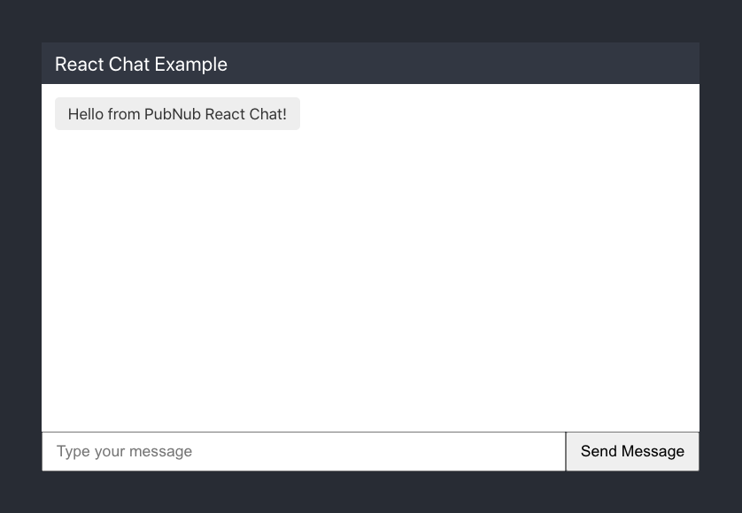

# PubNub React Framework

This is the official PubNub React framework repository.

PubNub takes care of the infrastructure and APIs needed for the realtime communication layer of your application. Work on your app's logic and let PubNub handle sending and receiving data across the world in less than 100ms.

* [Requirements](#requirements)
* [Get keys](#get-keys)
* [Sample app](#sample-app)
* [Documentation links](#documentation-links)
* [Reference information](#reference-information)
* [Support](#support)

## Requirements

To use the PubNub React framework, you need:

* React 16.8 or above
* PubNub [Javascript SDK](https://www.pubnub.com/docs/web-javascript/pubnub-javascript-sdk).

> This library is compatible with the latest versions of the React Native framework. For examples, refer to [examples/reactnative](/examples/reactnative).

## Get keys

You will need the publish and subscribe keys to authenticate your app. Get your keys from the [Admin Portal](https://dashboard.pubnub.com/).

## Sample app

Follow these instructions to set up a simple chat app using PubNub.

**Note**: These instructions assume you're using JavaScript. If you'd prefer to use TypeScript, follow the instructions in the [React framework documentation](https://www.pubnub.com/docs/chat/react/getting-started).

1. Set up your React project. For a quick single-page app, [create-react-app](https://reactjs.org/docs/create-a-new-react-app.html#create-react-app) is a good starting point:

    ```bash
    npx create-react-app hello-pubnub-react
    ```

1. Add the PubNub JavaScript SDK and React framework packages to your project:

    ```bash
    cd hello-pubnub-react
    npm install pubnub
    npm install pubnub-react
    ```

1. Replace the contents of `src/App.js` with the following, replacing `myPublishKey` and `mySubscribeKey` with your own keys, and `myUniqueUUID` with a value of your choice:

    ```javascript
    import React, { useState } from 'react';
    import PubNub from 'pubnub';
    import { PubNubProvider, PubNubConsumer } from 'pubnub-react';
    import './App.css';

    const pubnub = new PubNub({
    publishKey: 'myPublishKey',
    subscribeKey: 'mySubscribeKey',
    uuid: 'myUniqueUUID'
    });
    const channels = ['awesomeChannel'];

    function App() {
    const [messages, addMessage] = useState([]);
    const [message, setMessage] = useState('');

    const sendMessage = message => {
        pubnub.publish(
        {
            channel: channels[0],
            message,
        },
        () => setMessage('')
        );
    };

    return (
        <PubNubProvider client={pubnub}>
        <div className="App">
            <header className="App-header">
            <PubNubConsumer>
                {client => {
                client.addListener({
                    message: messageEvent => {
                    addMessage([...messages, messageEvent.message]);
                    },
                });

                client.subscribe({ channels });
                }}
            </PubNubConsumer>
            <div
                style={{
                width: '500px',
                height: '300px',
                border: '1px solid black',
                }}
            >
                <div style={{ backgroundColor: 'grey' }}>React Chat Example</div>
                <div
                style={{
                    backgroundColor: 'white',
                    height: '260px',
                    overflow: 'scroll',
                }}
                >
                {messages.map((message, messageIndex) => {
                    return (
                    <div
                        key={`message-${messageIndex}`}
                        style={{
                        display: 'inline-block',
                        float: 'left',
                        backgroundColor: '#eee',
                        color: 'black',
                        borderRadius: '20px',
                        margin: '5px',
                        padding: '8px 15px',
                        }}
                    >
                        {message}
                    </div>
                    );
                })}
                </div>
                <div
                style={{
                    display: 'flex',
                    height: '40px',
                    backgroundColor: 'lightgrey',
                }}
                >
                <input
                    type="text"
                    style={{
                    borderRadius: '5px',
                    flexGrow: 1,
                    fontSize: '18px',
                    }}
                    placeholder="Type your message"
                    value={message}
                    onChange={e => setMessage(e.target.value)}
                />
                <button
                    style={{
                    backgroundColor: 'blue',
                    color: 'white',
                    borderRadius: '5px',
                    fontSize: '16px',
                    }}
                    onClick={e => {
                    e.preventDefault();
                    sendMessage(message);
                    }}
                >
                    Send Message
                </button>
                </div>
            </div>
            </header>
        </div>
        </PubNubProvider>
    );
    }

    export default App;
    ```

1. In your project, run the following command:

    ```bash
    npm start
    ```

    You should see the following in your browser:
    

### Add listeners

In the code in the previous section, the following adds a message listener in the `PubNubConsumer`:

```javascript
    {client => {
    client.addListener({
        message: messageEvent => {
        addMessage([...messages, messageEvent.message]);
        },
    });
```

### Publish and subscribe

Publishing a message:

```javascript
const channels = ['awesomeChannel'];

// ...

const sendMessage = message => {
    pubnub.publish(
    {
        channel: channels[0],
        message,
    },
    () => setMessage('')
    );
};
```

Subscribing to a channel:

```javascript
const channels = ['awesomeChannel'];

// ...

client.subscribe({ channels });
```

## Documentation links

* [React framework documentation](https://www.pubnub.com/docs/chat/react/setup)
* [JavaScript SDK documentation](https://www.pubnub.com/docs/web-javascript/pubnub-javascript-sdk)
* [PubNub React/Redux team chat app](https://pubnub.github.io/typescript-ref-app-team-chat/docs/introduction)

## Reference information

* [PubNubConsumer](#pubnubconsumer)
* [PubNubProvider](#pubnubprovider)
* [usePubNub hook](#usepubnub-hook)

### PubNubProvider

The PubNubProvider makes available a PubNub client instance to a React component tree. You instantiate the provider as follows (note that this example assumes that your publish and subscribe keys are contained in the `pubnub.config.json` file):

```js
import PubNub from 'pubnub';
import { PubNubProvider } from 'pubnub-react';

const pubNubConfig = require('./pubnub.config.json');
const pubNubClient = new PubNub(pubNubConfig.Demo.keySet);

const App = () => {
  return (
    <PubNubProvider client={pubNubClient}>
      <MyRootComponent />
    </PubNubProvider>
  );
};

export default App;
```

#### PubNubProvider props

The PubNubProvider component takes a single prop:

- **client** is the required pubNubClient instance. This is used by all components that require PubNub functionality.

### usePubNub hook

The PubNub hook lets you interact with PubNub in function components.

Hooks are a new feature added in React 16.8 that allow you to use React features without writing a class. For a general overview of hooks, refer to [the React documentation](https://reactjs.org/docs/hooks-intro.html).

> **Note**: As you might expect, the `usePubNub` hook requires cleanup. For more information on the cleanup concept, refer to [the React documentation](https://reactjs.org/docs/hooks-effect.html#effects-with-cleanup).

#### Example `usePubNub` hook usage

```javascript
import React, { useState, useEffect } from 'react';
import { usePubNub } from '../../src/index';

const PubNubTime = () => {
  const client = usePubNub();
  const [time, setTime] = useState(null);
  const [error, setError] = useState(error);

  useEffect(() => {
    client
      .time()
      .then(({ timetoken }) => {
        setTime(timetoken);
      })
      .catch(error => {
        setError(error);
      });
  }, []);

  if (error !== null) {
    return <div>An error has occured: {error.message}</div>;
  }

  if (time === null) {
    return <div>Loading...</div>;
  }

  return <div>Current time: {time}</div>;
};

export default PubNubTime;
```

Then, to load `PubNubTime` on-demand, you could use `React.Lazy` and `Suspense`:

```javascript
import React, { Suspense, lazy } from 'react';

const MyRootComponent = () => {
  const DisplayPubNubTime = lazy(() => import('./PubNubTime'));

  return (
    <Suspense fallback={<div>Loading. . .</div>}>
      <DisplayPubNubTime />
    </Suspense>
  );
};

export default MyRootComponent;
```

### PubNubConsumer

The PubNubConsumer allows you to access the client instance you made available with a PubNubProvider.

> **Note**: Be careful, as the children function will be called every time component rerenders. Wrap components using PubNubConsumer using `React.memo` to prevent this behaviour.

#### PubNubConsumer props

The PubNubConsumer component takes a single prop:

- **client** is the required PubNub Client instance. This is used by all components that require PubNub functionality.

#### Example PubNubConsumer usage

Once you've created a PubNubProvider, you can access the client with a PubNubConsumer.

```js
import React from 'react';
import PubNub from 'pubnub';
import { PubNubProvider } from '../PubNubProvider';
import { PubNubConsumer } from '../PubNubConsumer';
import { getPubNubContext } from '../PubNubContext';

const pubNubConfig = require('../config/pubnub.json');
const pubNubClient = new PubNub(pubNubConfig.Demo.keySet);

const App = () => {
  return (
    <PubNubProvider client={pubNubClient}>
      <PubNubConsumer>
        {client => 'success!' /* do something now */}
      </PubNubConsumer>
    </PubNubProvider>
  );
};
```

## Support

If you **need help** or have a **general question**, contact <support@pubnub.com>.
